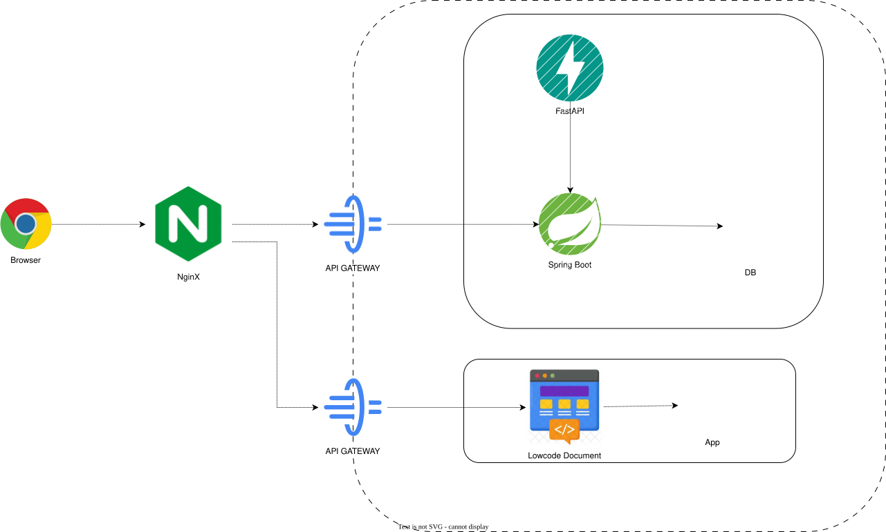
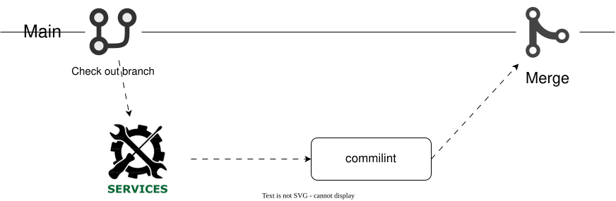
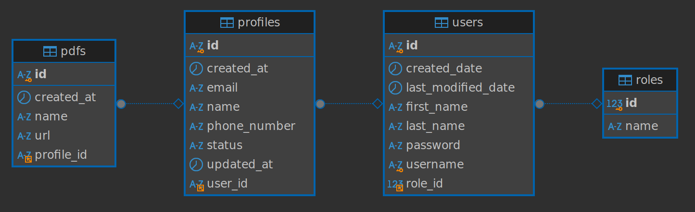

# HAUI-HITAnodisO

[](https://github.com/Anodis108/HAUI-HITAnodisO/blob/develop/LICENSE)
[](https://github.com/Anodis108/HAUI-HITAnodisO/issues)
[](https://github.com/Anodis108/HAUI-HITAnodisO/pulls)
[](https://github.com/Anodis108/HAUI-HITAnodisO/graphs/commit-activity)
[](https://github.com/Anodis108/HAUI-HITAnodisO/graphs/contributors)


# Ứng Dụng Hành Chính Một Cửa Hỗ Trợ Đóng Dấu Đơn Từ [](http://demo-link.com) [](https://project-docs.com)

<a href="https://github.com/Anodis108/HAUI-HITAnodisO/issues/new?assignees=&labels=&projects=&template=bug_report.md&title=">Bug Report ⚠️</a>
<a href="https://github.com/Anodis108/HAUI-HITAnodisO/issues/new?assignees=&labels=&projects=&template=feature_request.md&title=">Request Feature 👩‍💻</a>

Ứng dụng hỗ trợ đóng dấu và xử lý các đơn từ trong hệ thống hành chính, áp dụng công nghệ LCDP để giảm thiểu thời gian xử lý thủ công và nâng cao hiệu quả công việc. 

### Mục tiêu: 
- Xây dựng một ứng dụng giúp tự động hóa việc đóng dấu lên các đơn từ hành chính.
- Ứng dụng sử dụng công nghệ Low-Code Development Platform (LCDP) để dễ dàng cấu hình và triển khai.
- Giảm bớt thủ tục hành chính, giúp tiết kiệm thời gian và chi phí cho các cơ quan chức năng.


---

## 🔎 Danh Mục

1. [Giới Thiệu](#Giới-Thiệu)
2. [Chức Năng Chính](#chức-năng-chính)
3. [Tổng Quan Hệ Thống](#👩‍💻-tổng-quan-hệ-thống)
4. [Cấu Trúc Thư Mục](#cấu-trúc-thư-mục)
5. [Hướng Dẫn Cài Đặt](#hướng-dẫn-cài-đặt)
    - [📋 Yêu Cầu - Prerequisites](#yêu-cầu-📋)
    - [🔨 Cài Đặt](#🔨-cài-đặt)
6. [CI/CD](#ci/cd)
7. [🙌 Đóng Góp](#🙌-đóng-góp-cho-dự-án)
8. [📝 License](#📝-license)

---


---
=======

## Giới Thiệu

- [Ứng dụng hành chính một cửa](https://pbgdpl.haiphong.gov.vn/Hoi-dap-phap-luat/Bo-phan-Mot-cua-la-gi-Nhiem-vu-cua-Bo-phan-Mot-cua-98905.html) giúp các cơ quan hành chính đóng dấu nhanh chóng lên các đơn từ, chứng từ khi cần thiết, mà không cần đến thao tác thủ công.
- [Công nghệ LCDP](https://vfossa.vn/tin-tuc/gioi-thieu-chu-de-cuoc-thi-phan-mem-nguon-mo-olp-2024-709.html) cho phép các công cụ cấu hình dễ dàng và triển khai nhanh chóng mà không cần phải lập trình nhiều.
- Ứng dụng này giúp tối ưu hóa quy trình làm việc và tăng tính chính xác trong việc xử lý văn bản.


---

## Chức Năng Chính
# Cần xem lại
Dự án tập trung vào các chức năng chính sau:

- 🖼️ **Nhận các đơn từ** từ hình ảnh hoặc tệp PDF.
- 🖋️ **Đóng dấu tự động**: Đặt dấu trên các đơn từ theo yêu cầu.
- 🧾 **Quản lý tài liệu**: Quản lý các đơn từ đã được đóng dấu và lưu trữ.
<!-- - 🔄 **Tích hợp với các hệ thống khác**: Hỗ trợ liên kết với các hệ thống lưu trữ tài liệu điện tử. -->


---

## 👩‍💻 Tổng Quan Hệ Thống

Hệ thống sử dụng kiến trúc [Layered Architecture](https://topdev.vn/blog/kien-truc-phan-lop-layered-architecture/) để dễ dàng cấu hình và phát triển các module. Các công nghệ sử dụng trong hệ thống bao gồm:

- [Self-hosting](https://docs.lowcoder.cloud/lowcoder-documentation/setup-and-run/self-hosting): Xây dựng giao diện người dùng.
- [Spring Boot](https://spring.io/projects/spring-boot): Dựng các API backend cho hệ thống.
- [OpenCV](https://opencv.org/about/): Sử dụng để nhận diện hình ảnh và đóng dấu lên các đơn từ.
- [PyMuPDF](https://pymupdf.readthedocs.io/en/latest/): Đọc và xử lý các tệp PDF.
- [Docker](https://www.docker.com/): Containerize các service.
- [Docker Compose](https://docs.docker.com/compose/): Quản lý các container.
- [MySQL](https://www.mysql.com/): Cơ sở dữ liệu quan hệ.
- [FastAPI](https://fastapi.tiangolo.com/):Xây dựng các API web nhanh chóng với Python




---

## CI/CD

Project CI/CD sử dụng Github và [Github Actions](https://github.com/Anodis108/HAUI-HITAnodisO/tree/develop/.github/workflows) để tự động hóa quá trình build và deploy. Quy trình như hình vẽ sau:


- [commitlint.yml](https://github.com/Anodis108/HAUI-HITAnodisO/blob/develop/.github/workflows/commitlint.yml): Lint các commit message của các nhánh

---


## Cấu trúc thư mục

- [Backend](backend/README.md): Chứa các service backend, API, và các chức năng xử lý dấu.
<!-- - [Frontend]: Giao diện người dùng, dễ sử dụng và có thể cấu hình linh hoạt. -->
- [Docs](docs): Tài liệu về hệ thống, cuoocj thi, sử dụng.
- [AI](AI/README.md): Tài liệu về module xử lý ảnh


---
## API List
### Auth API
* Log in: [POST]: ```/api/v1/auth/login```
* Log out: [POST]: ```/api/v1/auth/logout```
### User API
* Get all user [GET]: ```/api/v1/user```
* Get user by id [GET]: ```/api/v1/user/{userId}```
* Get current user login [GET]: ```/api/v1/user/current```
* Create new user [POST]: ```/api/v1/user```
* Update user [PATCH]: ```/api/v1/user```
* Change password [PATCH]: ```/api/v1/user/changePassword```
* Delete user [DELETE]: ```/api/v1/user```
### Profile API
* Get all profile [GET]: ```/api/v1/profile```
* Get profile by userId [GET]: ```/api/v1/profile/user```
* Create new profile [POST]: ```/api/v1/profile```
* Update profile [PATCH]: ```/api/v1/profile```
* Accept profile [PATCH]: ```/api/v1/profile/accept```
* Reject profile [PATCH]: ```/api/v1/profile/reject```
* Delete profile [DELETE]: ```/api/v1/profile```
### PDF API
* Get PDF by profileId [GET]: ```/api/v1/pdf/profile```
* Upload new PDF in a profile [POST]: ```/api/v1/pdf```
* Delete PDF [DELETE]: ```/api/v1/pdf```
---
## Thiết kế Database

---

## Hướng Dẫn Cài Đặt

### Yêu Cầu 📋

Trước khi cài đặt, bạn cần cài đặt các công cụ sau:

- [Docker](https://www.docker.com/get-docker/)
- [Docker Compose](https://docs.docker.com/compose/install/)
- [NodeJS](https://nodejs.org/)

### 🔨 Cài Đặt

Trước hết, hãy clone dự án về máy tính của bạn:

```bash
git clone https://github.com/CTU-LinguTechies/VN-Law-Advisor.git vnlawadvisor
```
cd vào thư mục vnlawadvisor:

```bash
cd vnlawadvisor
```

## Đoạn này cần sửa
## Chạy backend hệ thống

-   Đầu tiên, cd vào thư mục backend:

```bash
cd backend
```

-   Start các services với 1 lệnh docker-compose:

```bash
docker-compose up -d
```

### Đoạn này cần sửa
### PORT BINDING

-   Sau khi chạy xong, các service sẽ được chạy trên các port như sau:
<table width="100%">
<thead>
<th>
Service
</th>
<th>
PORT
</th>
</thead>
<tbody>
<tr>
<td>API Gateway</td>
<td>

8000:12345

8001:12345

8002:12345

8003:12345

8004:12345

</td>

</tr>
<tr>
<td>Auth Service</td>
<td>5000:5000</td>
</tr>
<tr>
<td>Law Service</td>
<td>8080:8080</td>
</tr>
<tr>
<td>RAG Service</td>
<td>5001:5001</td>
</tr>
<tr>
<td>Recommendation Service</td>
<td>5002:5002</td>
</tr>
</tbody>
</table>

### Đoạn này cần sửa
### Chạy web-app

-   Đầu tiên, cd vào thư mục web:

```bash
cd web
```

-   Cài đặt các thư viện cần thiết:

```bash
npm install
```

-   Chạy web-app development mode:

```bash
npm run dev
```

Lúc này web-app sẽ chạy ở địa chỉ [http://localhost:3000](http://localhost:3000). Đến đây, bạn đã cài đặt xong. Còn nếu như bạn muốn chạy project ở môi trường production, hãy ngừng development server và chạy các lệnh sau:

-   Build frontend web-app

```bash
npm run build
```

-   Chạy web-app production mode:

```bash
npm run start
```

Lúc này web-app sẽ chạy ở địa chỉ [http://localhost:3000](http://localhost:3000).


## 🙌 Đóng góp cho dự án

<a href="https://github.com/Anodis108/HAUI-HITAnodisO/issues/new?assignees=&labels=&projects=&template=bug_report.md&title=">Bug Report ⚠️
</a>

<a href="https://github.com/Anodis108/HAUI-HITAnodisO/issues/new?assignees=&labels=&projects=&template=feature_request.md&title=">Feature Request 👩‍💻</a>

Nếu bạn muốn đóng góp cho dự án, hãy đọc [CONTRIBUTING.md](.github/CONTRIBUTING.md) để biết thêm chi tiết.

Mọi đóng góp của các bạn đều được trân trọng, đừng ngần ngại gửi pull request cho dự án.

## Liên hệ

-   Phạm Đăng Đông: dong10082003@gmail.com
-   Nguyễn Thị Trang: nguyenthitrang.ttd@gmail.com
-   Đỗ Trung Hòa: trunghoa2k4@gmail.com
-   Phạm Văn Hà:
-   Nguyễn Xuân Hoàng:
-   Nguyễn Trung Phú:

## 📝 License

This project is licensed under the terms of the [APACHE V2](LICENSE) license.