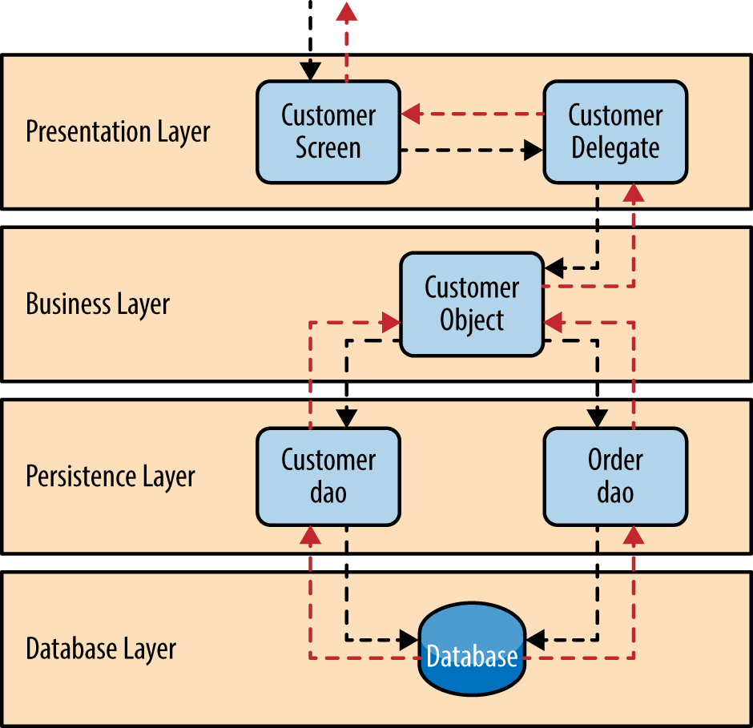

# **Backend**
##### (Toàn bộ mã nguồn backend sẽ nằm ở thư mục này)
# **Yêu Cầu Hệ Thống**
### Những yêu cầu về môi trường chạy dự án:

- **Java**: Java 17 trở lên.
- **Maven**: 3.8.7 hoặc mới hơn.
- **Database**: MySQL.

---

# **Cấu Trúc Thư Mục**

## Cấu trúc của dự án

```plaintext
project
├── src
│   ├── main
│   │   ├── java
│   │   │   ├── com.example.project
│   │   │       ├── config         
│   │   │       ├── controller     
│   │   │       ├── domain         
│   │   │       ├── repository     
│   │   │       ├── service        
│   │   │       ├── util           
│   │   ├── resources
│   │       ├── application.properties   # File cấu hình chính
│   │       ├── templates                # Các file giao diện (nếu có)
│   │       ├── static                   # Các tài nguyên tĩnh
├── pom.xml                     # File cấu hình Maven
```
### Giải thích từng thư mục
- `config`: Chứa các cấu hình của ứng dụng (các bean, cài đặt bảo mật, cấu hình database).
- `controller`: Lớp xử lý yêu cầu HTTP.
- `domain`: Chứa các entity ánh xạ với cơ sở dữ liệu.
- `repository`: Tầng giao tiếp với cơ sở dữ liệu.
- `service`: Xử lý logic của ứng dụng.
- `util`: Các tiện ích dùng chung.
- `application.properties`: File cấu hình chính.
- `pom.xml`: File cấu hình Maven.
---
# Hệ thống
### Thiết kế theo kiến trúc phân lớp như hình vẽ bên dưới:


### Auth Controller
* Auth Controller: Service xử lý việc đăng nhập, đăng ký, đăng xuất, xác thực người dùng.
  * Sử dụng JWT để phân quyền. Dùng access token và refresh token.
  * Sử dụng Client để lưu trữ refresh token.
  * Sử dụng MySQL để lưu trữ thông tin người dùng.

### Profile Controller
* Profile Controller: Controller quản lý các dữ liệu về hồ sơ.
  * Sử dụng MySQL để lưu trữ dữ liệu.
  * Sử dụng JPA để truy vấn dữ liệu.
  * Sử dụng SpringBoot.

### User Controller
* User Controller: Controller quản lý các dữ liệu về người dùng.
  * Sử dụng MySQL để lưu trữ dữ liệu.
  * Sử dụng JPA để truy vấn dữ liệu.
  * Sử dụng SpringBoot

### PDF Controller
* PDF Controller: Controller quản lý các dữ liệu về tài liệu trong hồ sơ dưới dạng file PDF.
  * Sử dụng MySQL để lưu trữ dữ liệu.
  * Sử dụng JPA để truy vấn dữ liệu.
  * Sử dụng SpringBoot.

## Công nghệ sử dụng
Dự án sử dụng các công nghệ sau:
* Java: Ngôn ngữ lập trình chính.
* Spring Boot: Framework backend.
* Hibernate: ORM để giao tiếp với database.
* MySQL: Hệ quản trị cơ sở dữ liệu.
* Maven: Công cụ quản lý dependencies.

## Pre-requisites - Yêu cầu

-   Cần có các công cụ sau để cài đặt và chạy một local server:
    -   [Docker](https://docs.docker.com/get-docker/)
    -   [Docker Compose](https://docs.docker.com/compose/install/)

## Hướng dẫn cài đặt

-   cd vào thư mục backend:

```bash
cd backend
```

-   Sử dụng Docker để xây dựng image từ Dockerfile. Chạy lệnh sau trong thư mục chứa Dockerfile:

```bash
docker build -t project-base .
```

-   Sau khi xây dựng image, bạn có thể chạy container bằng lệnh sau:

```bash
docker run -d -p 8080:8080 --name my-app project-base:1.0
```
- `-d`: Chạy container ở chế độ nền (detached mode).
- `-p 8080:8080`: Chuyển tiếp cổng 8000 từ máy host sang cổng 8080 của container.


## PORT BINDING

-   Sau khi chạy xong, các service sẽ được chạy trên các port như sau:
<table>
<thead>
<th>
Service
</th>
<th>
PORT
</th>
</thead>
<tbody>
<tr>
<td>API Gateway</td>
<td>

8080:8080

</td>

</tr>
</tbody>
</table>