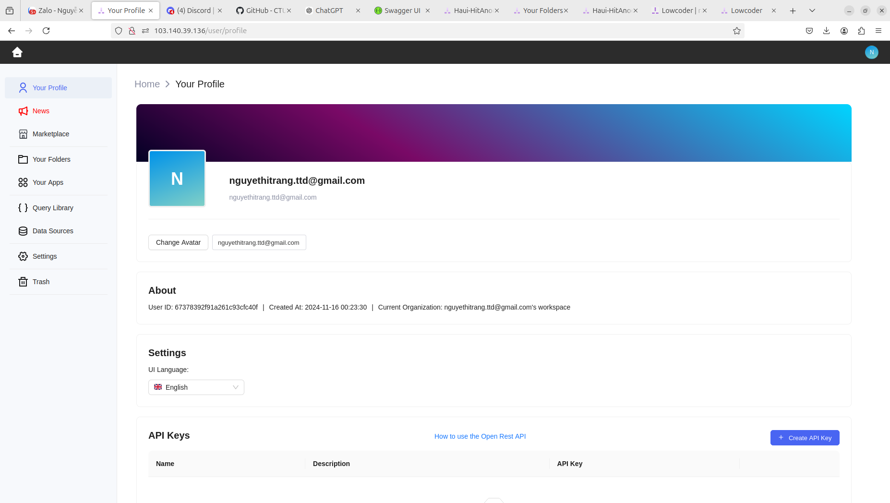
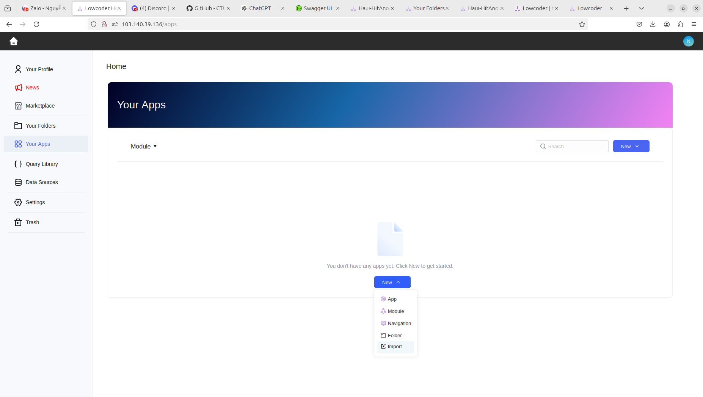
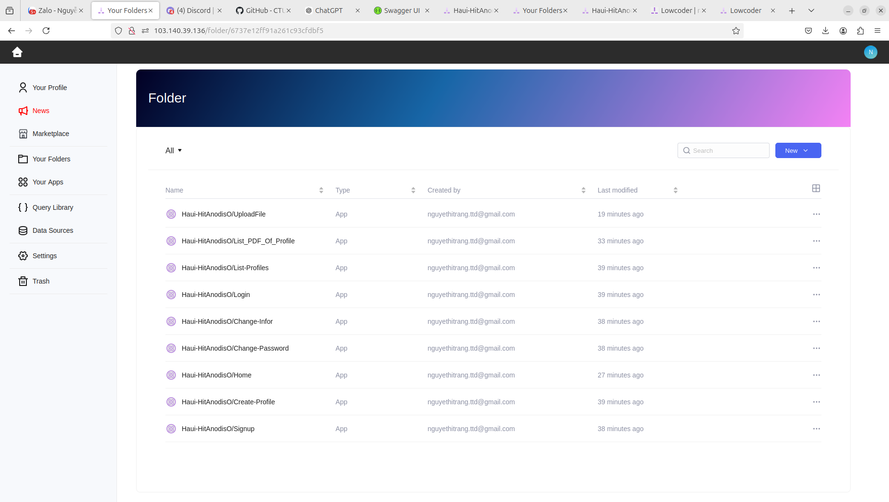
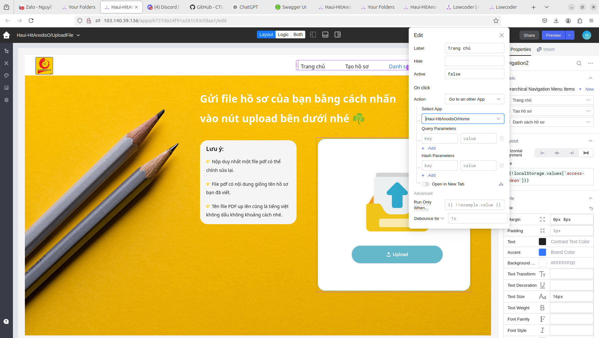
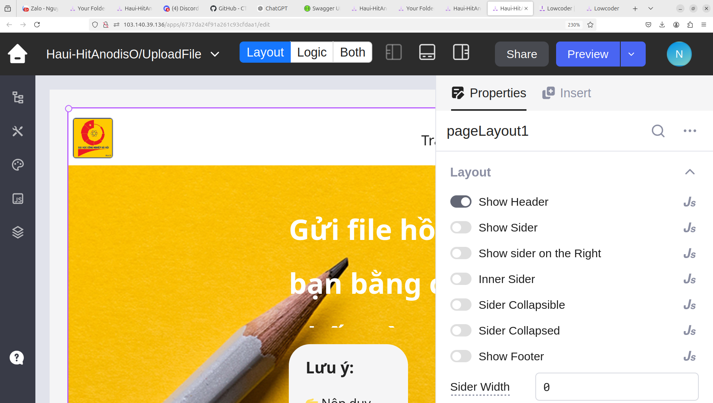

# **Frontend**

##### (Toàn bộ file cấu hình frontend ở phía nguời dùng sẽ nằm ở thư mục này)

# **Yêu Cầu Hệ Thống**

### Những yêu cầu về môi trường chạy dự án:

- **Môi trường: <a href='https://lowcoder.cloud/'>lowcoder</a>**

---

# **Hướng dẫn cài đặt file hệ thống trên lowcoder**

## Bước 1: Truy cập đường dẫn tôi để ỏ phía môi trường, đăng nhập hoặc tạo tài khoản của bạn.

Giao diện khi mới đăng nhập:

## Bước 2: Truy cập vào phần Your Apps của bạn ở trên sidebar của web nhần vào nút button "New" và chọn "Import"

## Bước 3: Import tất cả các file mà chúng tôi đã cũng cấp cho bạn ở trong thư mục src của thư mục frontend thuộc repository của chúng tôi trên lowcoder

## Bước 4: Sửa lại tất cả đường dẫn trong các thẻ link để import đúng file bằng cách clink vào một file và tìm navigate của file đó xong chọn Go to an another app và ở mục select app, lowcoder sẽ gợi ý cho chúng ta các app trong danh sách import.

## Bước 5: Sau khi sửa import xong thì bạn có thể bắt đầu xem nó bằng cách nhấn vô nút preview

